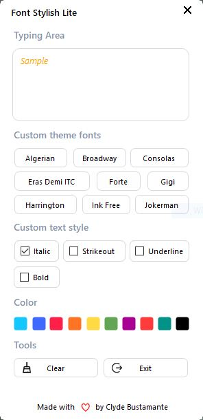

    

<h1 align="center">Font Stylish Lite: Your Elegant VB .NET Companion</h1>

📱 Meet Font Stylish Lite, a sleek and user-friendly VB .NET application. This elegant tool is designed to enhance your text and design projects effortlessly. With a host of features, it simplifies your experience while maintaining its simplicity.

## ✨ Feature
- 🚀 **Custom Theme Fonts**: Tailor your text with custom theme fonts. Choose from a selection of fonts to give your work a personalized touch, elevating its appeal.
- 📝 **Custom Text Styles**: Spice up your text with custom styles that add a touch of uniqueness. Whether bold, subtle, or somewhere in between, express yourself with ease..
- 🎨 **Vibrant Colors**: Select from a range of vibrant colors to add life to your projects. This feature allows you to infuse your creations with personality and creativity.
- 😎 **Efficient Tools**: Font Stylish Lite comes with handy tools like 'Clear' and 'Exit' to keep your workspace tidy and aid in seamless navigation.

> **Note:** Font Stylish Lite may be simple, but its capabilities are boundless. It's the perfect companion for your VB .NET needs, ensuring your work is clean, stylish, and efficient. Experience simplicity with sophistication.

## 📱 Preview

## **Thanks For Visiting**

Hope you liked it. Want to help?

- **[Star This Repository](https://github.com/clydebustamante/Font-Stylish-Lite)**

